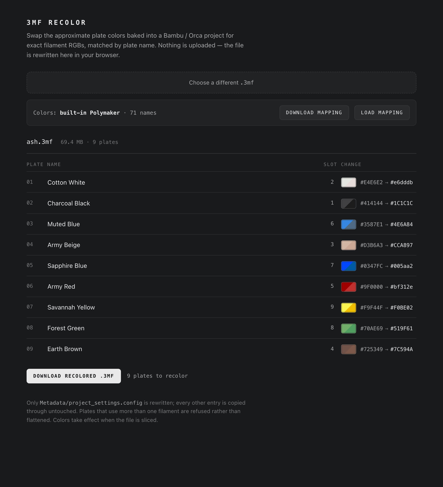

# 3MF Recolor

A single-page browser tool that rewrites the per-plate filament colors in a
Bambu Studio / OrcaSlicer `.3mf` project, matching each plate to an exact RGB by
its name.

**Everything happens in the browser.** No server, no upload, no build step, no
dependencies — `index.html` is the whole application. Open it from a `file://`
path and it works offline.



## Why

Multi-plate "kit" models are often organized one filament color per plate, with
the plate named after the color (`Cotton White`, `Army Red`). But the RGB values
baked into the project are usually the designer's eyeballed approximations, not
the manufacturer's published values — off by enough that automated color
matching picks the wrong spool:

| plate | in the file | actual Polymaker |
|---|---|---|
| Charcoal Black | `#414144` | `#1C1C1C` |
| Muted Blue | `#3587E1` | `#4E6A84` |
| Savannah Yellow | `#F9F44F` | `#F0BE02` |

Fixing these lets print-farm software (Bambuddy and similar) route each plate to
the printer that actually has that filament loaded.

## Use it

Open `index.html` in a browser. Drop in a `.3mf`. Review the plan. Download.

Each row shows a **split chip** — the old color on the upper left, the new one
on the lower right. A nearly solid chip means the color barely moved; an
obviously two-tone chip means it moved a lot.

### Colors

A Polymaker mapping is **built into `index.html`** — the app does not read
`colors.json` at runtime. (It couldn't: a page opened from `file://` isn't
allowed to fetch a sibling file.) The checked-in [`colors.json`](colors.json) is
a copy of that same mapping, kept for reference.

To use your own palette:

1. **Download mapping** — saves the mapping currently in use as `colors.json`.
2. Edit it in any text editor.
3. **Load mapping** — pick your edited file. It replaces the built-in one for
   this session. **Use built-in** switches back.

The mapping is a flat JSON object of `name → hex`:

```json
{
  "Cotton White": "#e6dddb",
  "Charcoal Black": "#1C1C1C",
  "Ash Gray": "#485155",
  "Ash Grey": "#485155"
}
```

Names match case-insensitively, exact first, then a *unique* substring (so
`Cotton White` also matches `PolyTerra™ Cotton White`). Ambiguous matches are
skipped rather than guessed. Both `gray` and `grey` spellings are included in
the built-in mapping, since manufacturers and designers disagree.

## What it changes

Only the `filament_colour` array in `Metadata/project_settings.config`. Every
other entry in the archive — including the meshes — is copied through byte for
byte.

A plate is **skipped**, never guessed at, when it:

- uses more than one filament (a two-color plate is not flattened to one color)
- shares a filament slot with another plate that wants a different color
- has no name, or a name that isn't in the mapping

> Colors take effect when the file is sliced. Bambu Studio copies
> `filament_colour` into `slice_info.config` during slicing, and that is what
> downstream tools read. Recoloring an unsliced project fixes the source, but
> nothing downstream sees it until someone slices.

## How it handles large files

A kit `.3mf` is often ~70 MB compressed and **several hundred MB uncompressed**
(the sample used in testing is 73 MB → 442 MB). Decompressing the whole archive
to change one small config file would be slow and memory-hungry.

Instead this reads the ZIP central directory and copies the **raw compressed
bytes** of every untouched entry straight into the output. Only the two small
`.config` entries are ever inflated; the meshes are never decompressed or even
examined. The rewritten config is written STORED (compression method 0), so no
compressor is needed at all.

Rewriting the 69 MB sample takes well under a second.

Uses `DecompressionStream`, `DOMParser`, `Blob`, and `File` — all native. No
polyfills, no libraries.

**Limits:** ZIP64 archives (>4 GB, or >65535 entries) are not handled. The whole
file is held in memory, so very large files depend on available browser memory.

## Tests

Drives the real page in a real browser via Playwright, from `file://`.

```sh
npm install
npm test                              # logic tests
npm test -- /path/to/sample.3mf       # + full round-trip on a real file
```

The round-trip test loads an actual `.3mf`, clicks through the UI, saves the
download, and verifies the produced archive: the entry set is unchanged, exactly
one entry differs, and within it only `filament_colour` changed.

## Related

The same recolor logic exists as a Go CLI in
[`read3mf`](https://github.com/dstockto/read3mf), which can also generate the
color mapping from a Spoolman inventory via `fil find --json`.
